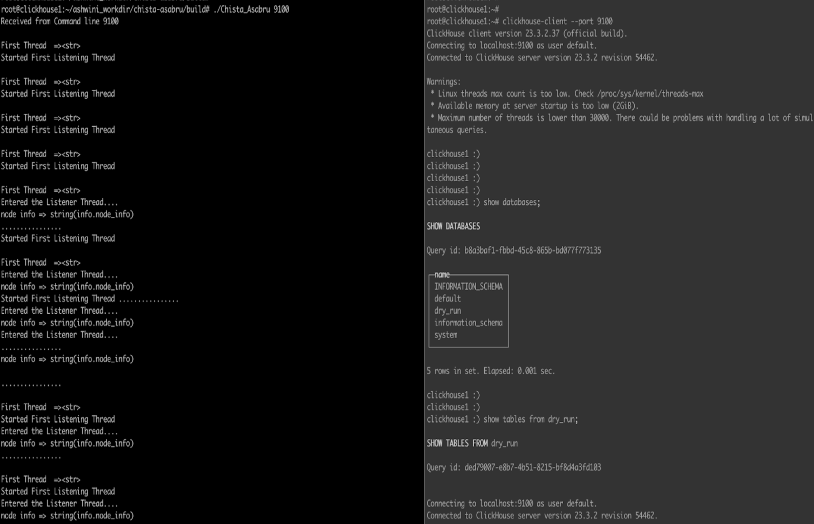
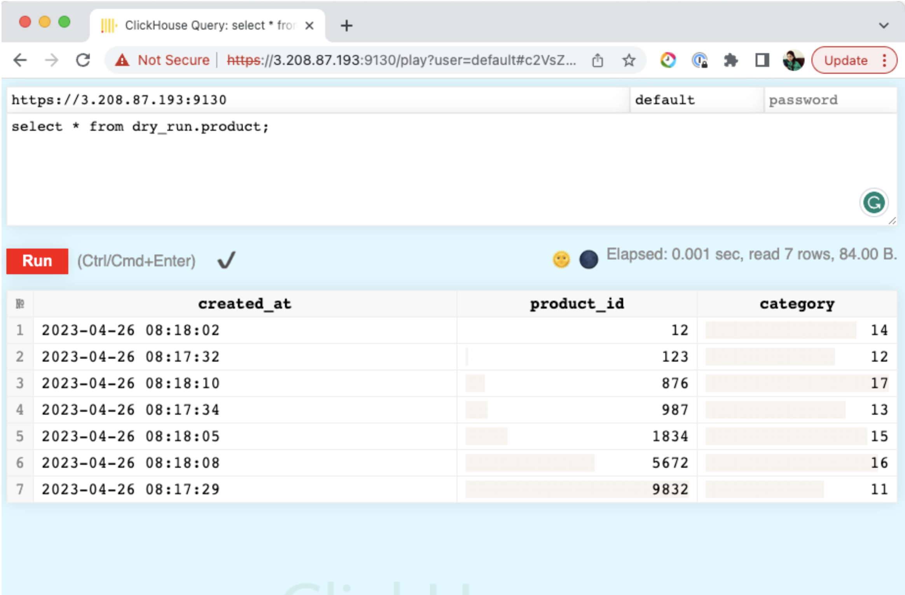
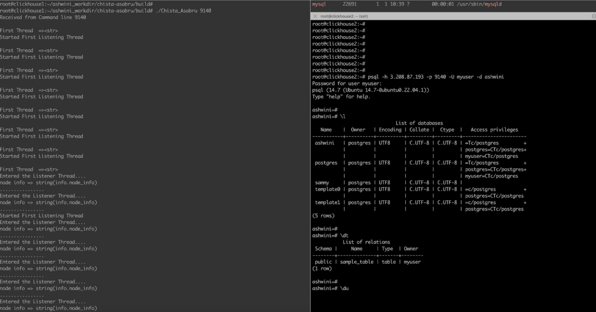

## Introduction

### What is ChistaDATA Asabru Proxy

- Asabru is a high-performance SQL Proxy developed by ChistaDATA, designed to improve the scalability and availability of database servers like ClickHouse, PostgreSQL, and MySQL. Asabru server enables users to easily configure and manage their database connections while enhancing their database performance.

At present, Asabru supports TCP/IP, HTTP/HTTPS, and TLS/SSL protocols for ClickHouse.

### ClickHouse Proxying

It supports the different client drivers for ClickHouse proxying

- Python Client
- Java Client (JDBC)
- DotNet Client

Sample Test Programs are available from [github-repo](https://github.com/ChistaDATA/chista-asabru/tree/main/automation_testing/ClickHouse)

### Usage

The proxy configurations are given in the `config.xml` file, we need to set the config file path location in ENV variables. Proxy will fetch the
configurations from that location and start the server.

```
 ./build/Chista_Asabru
```

Run the ClickHouse client in SSL mode
```
./clickhouse client --config <your-config-path>/clickhouse-client-ssl.xml --host 127.0.0.1 --port 9120

Eg. ./clickhouse client --config /Users/username/software/openssl/clickhouse-client-ssl.xml --host 127.0.0.1 --port 9120
```

The above-mentioned steps will start the Asabru server and enable it to proxy connections for ClickHouse using TCP/TLS with the WireLevel protocol. The proxy will now be ready to accept incoming connections on the specified port number.

Asabru servers support various configurations to suit different needs and use cases. The proxy server operates on specific port numbers that correspond to the protocol used by the underlying database system.
By leveraging the Asabru server, users can benefit from its efficient and reliable proxying capabilities, making it an excellent tool for database management and optimization.

The port numbers for proxy given in the table are not fixed and can be changed from the proxy configuration file , if required. Here are the details about [proxy configuration](docs/configuration.md) 

Asabru server provides users with an efficient and flexible way to manage their database connections through a range of proxy port numbers for various config types, allowing users to configure and manage their database connections with ease. Here are the available configurations:

| #   | Proxy Port # | DB Port # | Description                                                                                      | Proxy Mode  | Status |
|-----|--------------|-----------|--------------------------------------------------------------------------------------------------|-------------|--------|
| 1   | 9100         | 9000      | Clickhouse Wirelevel Protocol ( various versions )                                               | Passthrough | Done   |
| 2   | 9110         | 8123      | ClickHouse Java (POST), Python(GET),HTTP(POST) with Base64 encoded WireLevel Protocol            | Passthrough | Done   |
| 3   | 9120         | 9440      | ClickHouse TCP/TLS with WireLevel Protocol, Termination and routing to 9440                      | Passthrough | Done   |
| 4   | 9130         | 8443      | ClickHouse HTTPS with Java (POST), Python(GET),HTTP(POST) with Base64 encoded WireLevel Protocol | Passthrough | Done   |
| 5   | 9140         | 5432      | PostgreSQL Wirelevel Protocol                                                                    | Passthrough | Done   |
| 6   | 9150         | 2345      | PostgreSQL TLS Wirelevel protocol                                                                | Passthrough | Done   |
| 7   | 9160         | 3306      | MySQL Wirelevel Protocol                                                                         | Passthrough | Done   |
| 8   | 9170         | 3306      | MySQL TLS Wirelevel protocol                                                                     | Passthrough | Done   |

To run the proxy set the proxy configurations with required port numbers, and you can start proxy by running the following command :

> ./Chista_Asabru

By following these simple steps, you can easily run the Asabru server proxy from the command line for various database systems and configurations. This provides users with a powerful tool for managing their database connections and optimizing their database performance.

Our current version of Asabru serves as a highly efficient forward proxy for client connections to ClickHouse, PostgreSQL, and MySQL databases. However, our long-term vision is to expand its capabilities to support multiple popular databases with a more robust reverse proxy that can intelligently interpret SQL and take appropriate actions for load balancing and high availability. With this enhanced functionality, Asabru will not only continue to serve as a forward proxy for clients but will also act as a reverse proxy for backend database servers.


## Visual aid included






## Glossary

**Proxy Mode - Passthrough mode**

Passthrough mode refers to a mode of operation where the proxy simply forwards the incoming network traffic to the destination database server without performing any modification or interpretation of the data.
In Passthrough mode, the Asabru server acts as a transparent intermediary between the client and the database server, relaying network packets without any modification to the underlying protocol or data. This mode is useful in situations where the client application and the database server have a direct network connection and the Asabru server is simply acting as a "pass-through" proxy, providing an extra layer of security or performance optimization without interfering with the communication between the client and server.

**Wirelevel Protocol**

The Wirelevel Protocol is a low-level communication protocol used by MySQL/ClickHouse/PostgreSQL to exchange information between the client and server. It is based on TCP/IP and supports a binary format making it efficient for transmitting large amounts of data. It includes features such as authentication, encryption, and compression to ensure secure and efficient communication between the client and the server.
Examples of client applications that use the Wire-level Protocol include the MySQL command-line client, MySQL Workbench, and various programming languages connectors such as JDBC for Java or the MySQL-python library for Python.

